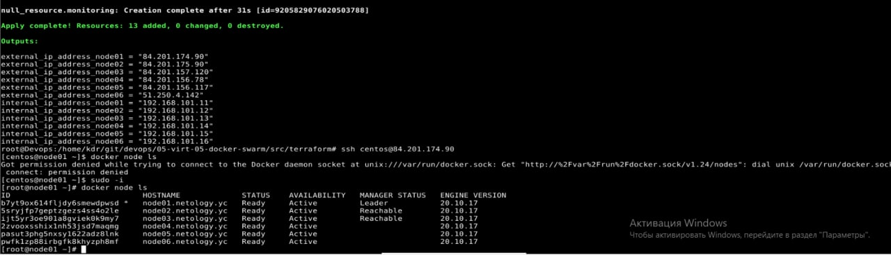
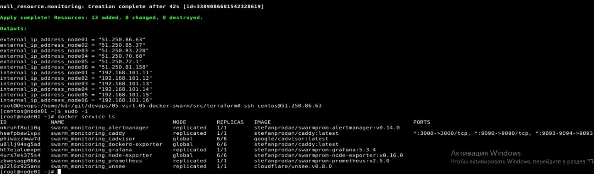

# Домашнее задание к занятию "5.5. Оркестрация кластером Docker контейнеров на примере Docker Swarm"

## Задача 1

<details>
<summary>Описание</summary>
Дайте письменые ответы на следующие вопросы:

- В чём отличие режимов работы сервисов в Docker Swarm кластере: replication и global?
- Какой алгоритм выбора лидера используется в Docker Swarm кластере?
- Что такое Overlay Network?
</details>

## Решение:
В чём отличие режимов работы сервисов в Docker Swarm кластере: replication и global?
```
В режиме replicated приложение запускается в том количестве экземпляров, какое укажет пользователь. При этом на отдельной ноде может быть как несколько экземпляров приложения, так и не быть совсем.
В режиме global приложение запускается обязательно на каждой ноде и в единственном экземпляре.
```
Какой алгоритм выбора лидера используется в Docker Swarm кластере?
```
Алгоритм Raft

 Чёткое разделение фаз. Raft предлагает декомпозицию задачи управления кластером на несколько слабо связанных подзадач, основные из которых: выбор лидера (голосование) и репликация протоколов. Каждая из этих задач допускает более детальное разделение. Это упрощает понимание алгоритма и снижает риск ошибок при его реализации.
- Явно выделенный лидер. Raft предполагает, что на кластере всегда существует явно выделенный лидер. Только этот лидер отправляет новые записи на другие узлы кластера. Таким образом, остальные узлы следуют за лидером и не взаимодействуют между собой (за исключением фазы голосования). Если внешний клиент подключается к кластеру через обычный узел, то все его запросы перенаправляются лидеру и только оттуда приходят на узлы.
- Протоколы работы не могут содержать пропусков. То есть записи добавляются строго последовательно. Это накладывает некоторые ограничения, по сравнению с Паксос, но позволяет очень сильно упростить алгоритм. Кроме того, специфика прикладных задач, чаще всего, не позволяет корректно работать с протоколами, содержащими пропуски. То, что Паксос допускает возникновение таких пропусков, зачастую является недостатком Паксос, с которым очень трудно бороться.
- Изменение размера кластера. Raft позволяет легко менять конфигурацию кластера, не останавливая работы: добавлять или удалять узлы.
```
Что такое Overlay Network?
```
Overlay-сеть создает подсеть, которую могут использовать контейнеры в разных хостах swarm-кластера. Контейнеры на разных физических хостах могут обмениваться данными по overlay-сети
В основе лежит технология vxlan которая инкапсулирует layer 2 фреймы в layer 4 пакеты (UDP/IP). При помощи этого действия Docker создает виртуальные сети поверх существующих связей между хостами, которые могут оказаться внутри одной подсети. Любые точки, которые являются частью этой виртуальной сети, выглядят друг для друга так, будто они связаны поверх свича и не заботятся об устройстве основной физической сети.
```
## Задача 2

<details>
<summary>Описание</summary>
Создать ваш первый Docker Swarm кластер в Яндекс.Облаке

Для получения зачета, вам необходимо предоставить скриншот из терминала (консоли), с выводом команды:
```
docker node ls
```
</details>

## Решение:


## Задача 3

<details>
<summary>Описание</summary>
Создать ваш первый, готовый к боевой эксплуатации кластер мониторинга, состоящий из стека микросервисов.

Для получения зачета, вам необходимо предоставить скриншот из терминала (консоли), с выводом команды:
```
docker service ls
```
</details>

## Решение:


## Задача 4 (*)

Выполнить на лидере Docker Swarm кластера команду (указанную ниже) и дать письменное описание её функционала, что она делает и зачем она нужна:
```
# см.документацию: https://docs.docker.com/engine/swarm/swarm_manager_locking/
docker swarm update --autolock=true
```


---

### Как cдавать задание

Выполненное домашнее задание пришлите ссылкой на .md-файл в вашем репозитории.

---
