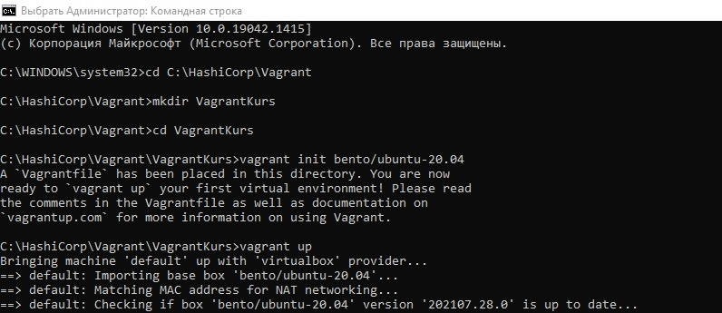
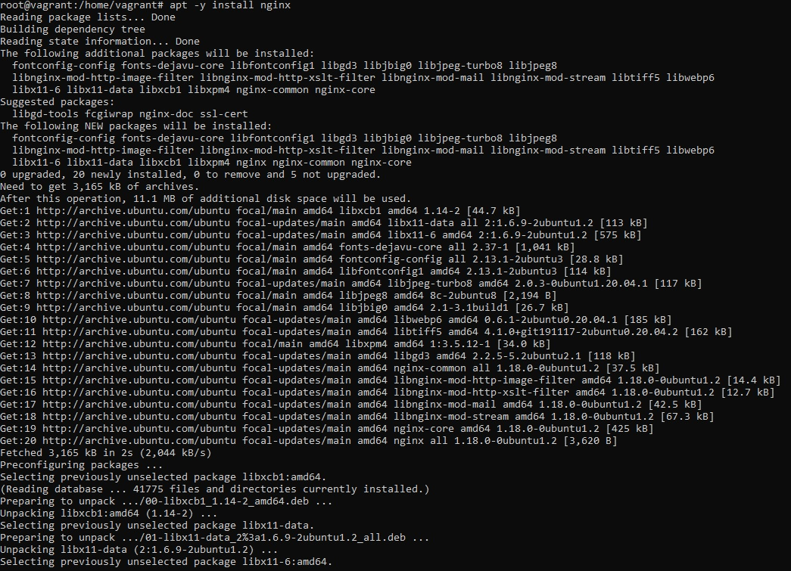
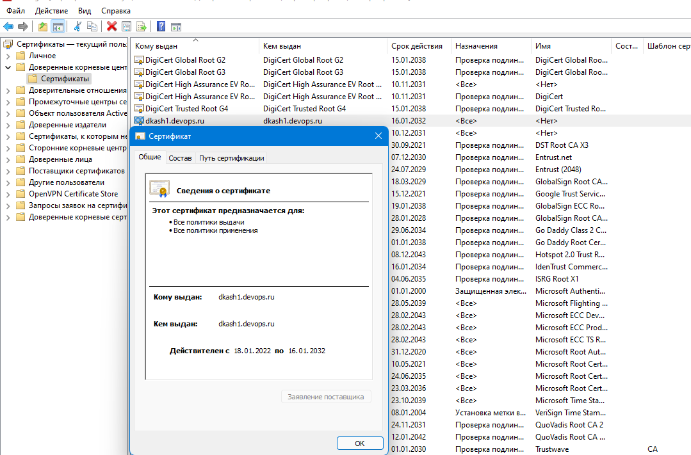
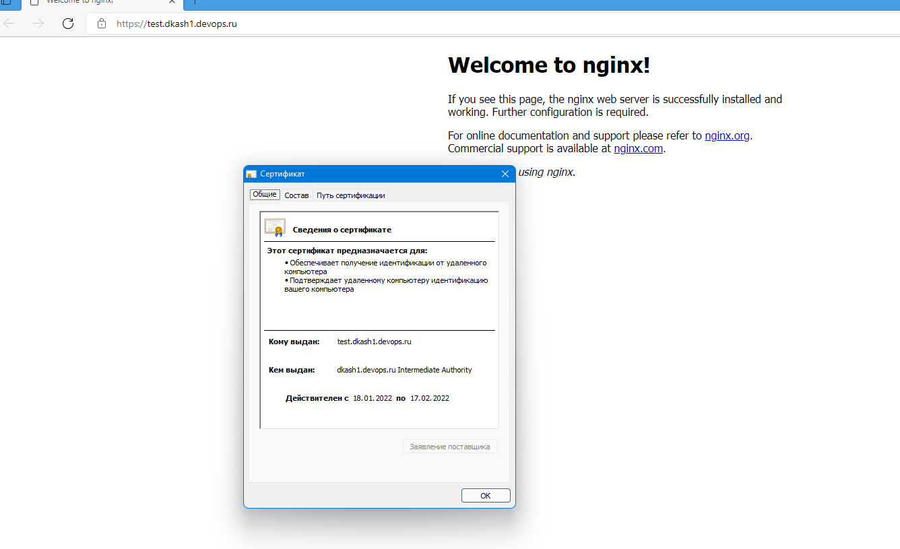

1. Создайте виртуальную машину Linux.
Создана:


2. Установите ufw и разрешите к этой машине сессии на порты 22 и 443, при этом трафик на интерфейсе localhost (lo) должен ходить свободно на все порты.
Установите nginx.

На этом этапе установлен nginx т.к. с его установкой появились конфиги для ufw облегчающие создание правил.



```
root@vagrant:/home/vagrant# ufw enable
Command may disrupt existing ssh connections. Proceed with operation (y|n)? y
Firewall is active and enabled on system startup
root@vagrant:/home/vagrant# ufw status verbose
Status: active
Logging: on (low)
Default: deny (incoming), allow (outgoing), disabled (routed)
New profiles: skip
```

Создаем правила:
```
root@vagrant:/home/vagrant# ufw allow 'Nginx HTTPS'
Skipping adding existing rule
Skipping adding existing rule (v6)
root@vagrant:/home/vagrant# ufw allow 'Openssh'
Skipping adding existing rule
Skipping adding existing rule (v6)
root@vagrant:/home/vagrant# ufw deny 'Nginx HTTP'
Skipping adding existing rule
Skipping adding existing rule (v6)
root@vagrant:/home/vagrant# ufw allow from 127.0.0.1
Skipping adding existing rule
root@vagrant:/home/vagrant# ufw status verbose
Status: active
Logging: on (low)
Default: deny (incoming), allow (outgoing), disabled (routed)
New profiles: skip

To                         Action      From
--                         ------      ----
22/tcp (OpenSSH)           ALLOW IN    Anywhere
443/tcp (Nginx HTTPS)      ALLOW IN    Anywhere
80/tcp (Nginx HTTP)        DENY IN     Anywhere
Anywhere                   ALLOW IN    127.0.0.1
22/tcp (OpenSSH (v6))      ALLOW IN    Anywhere (v6)
443/tcp (Nginx HTTPS (v6)) ALLOW IN    Anywhere (v6)
80/tcp (Nginx HTTP (v6))   DENY IN     Anywhere (v6)
```

3. Установите hashicorp vault ([инструкция по ссылке](https://learn.hashicorp.com/tutorials/vault/getting-started-install?in=vault/getting-started#install-vault)).

Решение:
```
    curl -fsSL https://apt.releases.hashicorp.com/gpg | sudo apt-key add -
    sudo apt-add-repository "deb [arch=amd64] https://apt.releases.hashicorp.com $(lsb_release -cs) main"
    sudo apt-get update && sudo apt-get install vault
    systemctl start vault && systemctl enable vault
```

4. Cоздайте центр сертификации по инструкции ([ссылка](https://learn.hashicorp.com/tutorials/vault/pki-engine?in=vault/secrets-management)) и выпустите сертификат для использования его в настройке веб-сервера nginx (срок жизни сертификата - месяц).

Решение:

 vault operator init
    vault operator unseal
    vault secrets enable pki
    vault secrets tune -max-lease-ttl=87600h pki
    vault write -field=certificate pki/root/generate/internal      common_name="dkash1.devops.ru"      ttl=87600h > CA_cert.crt
    vault write pki/config/urls      issuing_certificates="$VAULT_ADDR/v1/pki/ca"      crl_distribution_points="$VAULT_ADDR/v1/pki/crl"
    vault secrets enable -path=pki_int pki
    vault secrets tune -max-lease-ttl=43800h pki_int
    vault write -format=json pki_int/intermediate/generate/internal common_name="dkash1.devops.ru Intermediate Authority" | jq -r '.data.csr' > pki_intermediate.csr
    vault write -format=json pki/root/sign-intermediate csr=@pki_intermediate.csr      format=pem_bundle ttl="43800h"      | jq -r '.data.certificate' > intermediate.cert.pem
    vault write pki_int/intermediate/set-signed certificate=@intermediate.cert.pem
    vault write pki_int/roles/example-dot-com allowed_domains="test.dkash1.devops.ru" allow_subdomains=true max_ttl="720h"
    vault write pki_int/issue/example-dot-com common_name="test.dkash1.devops.ru" ttl="720h"
 


6. Установите nginx.

Установлен, ранее.
```
root@vagrant:/home/vagrant# apt -y install nginx
Reading package lists... Done
Building dependency tree
Reading state information... Done
The following additional packages will be installed:
  fontconfig-config fonts-dejavu-core libfontconfig1 libgd3 libjbig0 libjpeg-turbo8 libjpeg8
  libnginx-mod-http-image-filter libnginx-mod-http-xslt-filter libnginx-mod-mail libnginx-mod-stream libtiff5 libwebp6
  libx11-6 libx11-data libxcb1 libxpm4 nginx-common nginx-core
Suggested packages:
  libgd-tools fcgiwrap nginx-doc ssl-cert
The following NEW packages will be installed:
  fontconfig-config fonts-dejavu-core libfontconfig1 libgd3 libjbig0 libjpeg-turbo8 libjpeg8
  libnginx-mod-http-image-filter libnginx-mod-http-xslt-filter libnginx-mod-mail libnginx-mod-stream libtiff5 libwebp6
  libx11-6 libx11-data libxcb1 libxpm4 nginx nginx-common nginx-core
0 upgraded, 20 newly installed, 0 to remove and 5 not upgraded.
```
7. По инструкции ([ссылка](https://nginx.org/en/docs/http/configuring_https_servers.html)) настройте nginx на https, используя ранее подготовленный сертификат:
  - можно использовать стандартную стартовую страницу nginx для демонстрации работы сервера;
  - можно использовать и другой html файл, сделанный вами;
```
root@vagrant:/home/vagrant# cat /etc/nginx/sites-available/test.dkash1.devops.ru
server {
  listen 443 ssl default_server;
  listen [::]:443 ssl default_server;
  ssl_certificate  /etc/cert_script/certificate.pem;
  ssl_certificate_key /etc/cert_script/private_key.pem;
  ssl_trusted_certificate /etc/cert_script/ca_chain.pem;
  root /var/www/html;
  index index.html index.htm;
  server_name test.dkash1.devops.ru;
  location / {
          try_files $uri $uri/ =404;
  }
}
```

8. Откройте в браузере на хосте https адрес страницы, которую обслуживает сервер nginx.

Решение:



9. Создайте скрипт, который будет генерировать новый сертификат в vault:
  - генерируем новый сертификат так, чтобы не переписывать конфиг nginx;
  - перезапускаем nginx для применения нового сертификата.

Ответ:
```bash
#!/bin/bash
vault login s.ZkqzActnFr4p6XRdpajRhuiH
              

vault write pki_int/issue/example-dot-com common_name="test.dkash1.devops.ru" ttl="720h" -format=json > /etc/cert_script/data.json

cat /etc/cert_script/data.json | jq -r '.data.ca_chain[0]' > /etc/cert_script/ca_chain.pem
cat /etc/cert_script/data.json | jq -r '.data.certificate' > /etc/cert_script/certificate.pem
cat /etc/cert_script/data.json | jq -r '.data.issuing_ca' > /etc/cert_script/issuing_ca.pem
cat /etc/cert_script/data.json | jq -r '.data.private_key' > /etc/cert_script/private_key.pem

rm /etc/cert_script/data.json

systemctl reload nginx
```
10. Поместите скрипт в crontab, чтобы сертификат обновлялся какого-то числа каждого месяца в удобное для вас время.

```bash
crontab -l
# 0 0 1 1-12 * sh /etc/cert_script/script_ngx.sh
```
Установим cron запуск скрипта раз в минуту 
```bash

* * * * * sh /etc/cert_script/script_ngx.sh
root@vagrant:~# grep CRON /var/log/syslog

Jan 19 18:01:01 vagrant CRON[10487]: (root) CMD (sh /etc/cert_script/script_ngx.sh )
Jan 19 18:02:01 vagrant CRON[10492]: (root) CMD (sh /etc/cert_script/script_ngx.sh )
Jan 19 18:03:01 vagrant CRON[11301]: (root) CMD (sh /etc/cert_script/script_ngx.sh )

systemctl status nginx
● nginx.service - A high performance web server and a reverse proxy server
     Loaded: loaded (/lib/systemd/system/nginx.service; enabled; vendor preset: enabled)
     Active: active (running) since Wed 2022-01-19 18:00:04 UTC; 1h 37min ago
       Docs: man:nginx(8)
    Process: 8400 ExecStartPre=/usr/sbin/nginx -t -q -g daemon on; master_process on; (code=exited, status=0/SUCCESS)
    Process: 8401 ExecStart=/usr/sbin/nginx -g daemon on; master_process on; (code=exited, status=0/SUCCESS)
    Process: 11412 ExecReload=/usr/sbin/nginx -g daemon on; master_process on; -s reload (code=exited, status=0/SUCCESS)
   Main PID: 8412 (nginx)
      Tasks: 3 (limit: 1112)
     Memory: 5.8M
     CGroup: /system.slice/nginx.service
             ├─ 8412 nginx: master process /usr/sbin/nginx -g daemon on; master_process on;
             ├─11413 nginx: worker process
             └─11414 nginx: worker process

Jan 19 18:01:01  vagrant systemd[1]: Reloading A high performance web server and a reverse proxy server.
Jan 19 18:02:01 vagrant systemd[1]: Reloaded A high performance web server and a reverse proxy server.
Jan 19 18:03:01 vagrant systemd[1]: Reloading A high performance web server and a reverse proxy server.

